# PulseBoard

A full-stack data pipeline and live dashboard that ingests stories from Hacker News and headlines from NewsAPI, transforms and scores them with dbt, stores everything in PostgreSQL, and serves it through a real-time Next.js dashboard — orchestrated by Apache Airflow.

## Tech Stack

| Layer             | Technology                                    | Status |
|-------------------|-----------------------------------------------|--------|
| Ingestion         | Python 3.13, requests, python-dotenv          | ✅     |
| Storage           | PostgreSQL 14                                 | ✅     |
| Transformation    | dbt 1.11 (data build tool)                    | ✅     |
| Orchestration     | Apache Airflow                                | ✅     |
| API               | FastAPI, psycopg2                             | ✅     |
| Frontend          | Next.js 14, Tailwind CSS, SWR                 | ✅     |
| Streaming         | Apache Kafka via Docker                       | ✅     |
| NLP               | TextBlob / VADER (sentiment analysis)         | 🔲     |
| Containerization  | Docker Compose                                | 🔲     |
| CI/CD             | GitHub Actions                                | 🔲     |
| Authentication    | NextAuth.js                                   | 🔲     |
| Alerting          | Email (smtplib) / Slack Webhooks              | 🔲     |

---

## Context

### The Problem

Tracking what's trending across tech communities and news outlets means checking multiple sources manually — Hacker News, various news sites, social media. There's no single view that aggregates, ranks, and refreshes this data automatically.

### Constraints

- API keys must never be hardcoded or committed to version control
- Pipeline must be idempotent — safe to re-run without creating duplicate data
- Data transformations must be version-controlled SQL, not ad-hoc scripts
- Must use free-tier APIs to keep the project accessible for learning
- Each phase must be independently functional before moving to the next

### Stakes

Portfolio project demonstrating end-to-end data engineering: API ingestion, relational database design, SQL transformations with dbt, pipeline orchestration with Airflow, REST API development with FastAPI, and a live frontend with Next.js.

### My Role

**Title:** Full-Stack Developer & Data Engineer

**Team:** Personal Project

**Ownership:** End-to-end ownership: data pipeline architecture, database schema design, dbt modeling, API development, frontend dashboard, and deployment.

---

## Architecture

```
┌──────────────┐     ┌──────────────┐
│  Hacker News │     │   NewsAPI    │
│     API      │     │              │
└──────┬───────┘     └──────┬───────┘
       │                    │
       ├────────────────────┤
       │                    │
       ▼                    ▼
┌─────────────────┐  ┌──────────────────────────────────┐
│  Kafka Streaming │  │       Batch Ingestion Layer       │
│  (real-time)     │  │  hn_fetcher.py  news_fetcher.py   │
│  producer →      │  │  (scheduled via Airflow hourly)   │
│  consumer        │  └──────────────┬───────────────────┘
└────────┬────────┘                  │
         │                           │
         └─────────┬─────────────────┘
                   ▼
┌──────────────────────────────────┐
│      PostgreSQL (raw schema)     │
│  hn_stories  │  news_articles    │
└──────────────┬───────────────────┘
               │
               ▼
┌──────────────────────────────────┐
│     dbt Transformations          │
│  staging → marts → trending      │
└──────────────┬───────────────────┘
               │
               ▼
┌──────────────────────────────────┐
│         FastAPI REST API         │
│  /trending  /stories  /articles  │
└──────────────┬───────────────────┘
               │
               ▼
┌──────────────────────────────────┐
│     Next.js + Tailwind CSS       │
│       Live Dashboard             │
└──────────────────────────────────┘
```

---

## Approach & Key Decisions

### Hacker News API over Reddit API for data ingestion

Reddit's API required OAuth app registration, which was blocked by persistent rate-limiting and reCAPTCHA issues during setup. The Hacker News API is completely open — no authentication, no API keys, no sign-up — and provides the same core data (titles, scores, comment counts, URLs, timestamps). This let us start building immediately without being blocked by external dependencies.

### Upserts (INSERT ... ON CONFLICT) for idempotent ingestion

Data pipelines run repeatedly on a schedule. Without upserts, re-running a fetcher would either crash on duplicate primary keys or insert duplicate rows. Using `INSERT ... ON CONFLICT DO NOTHING` makes every pipeline run safe to repeat — a core principle of reliable data engineering.

### Separate raw, staging, and marts layers in dbt

Raw data stays untouched in the `raw` schema exactly as it arrived from the API. Staging models clean and standardize it (casting types, filtering nulls). Marts models join sources and build business-ready analytics tables. This layered approach means upstream changes don't break downstream consumers, and each layer can be tested independently.

### dbt over raw SQL scripts for transformations

dbt provides dependency management (via `ref()`), built-in testing, and version-controlled SQL. Writing raw SQL scripts would work, but you'd have to manually manage execution order, handle errors yourself, and lose the ability to test data quality assertions like `unique` and `not_null`.

### python-dotenv for all secrets management

Every API key and database credential lives in a `.env` file that is git-ignored. The `.env.example` file documents what variables are needed without exposing actual values. This prevents accidental credential exposure in version control.

### Kafka streaming alongside Airflow batch processing (not replacing it)

A common misconception is that streaming replaces batch processing. In practice, most production pipelines use both. Airflow handles reliable, scheduled bulk ingestion — guaranteed to run every hour, with retries and monitoring. Kafka handles real-time event streaming — lower latency, but requires always-on infrastructure (Zookeeper, broker, consumer). PulseBoard implements both so the pipeline can be evaluated under either pattern, and both write to the same PostgreSQL tables using the same upsert logic.

### Confluent Kafka over kafka-python library

Two main Python Kafka libraries exist: `kafka-python` (pure Python) and `confluent-kafka` (C-backed wrapper around librdkafka). We chose `confluent-kafka` because it's significantly faster, actively maintained by Confluent (the company behind Kafka), and is the industry standard for production Kafka workloads. The tradeoff is a C dependency, but on Mac with Homebrew this installs cleanly.

### Docker Compose for local Kafka infrastructure

Kafka requires multiple services (Zookeeper for coordination, the Kafka broker itself). Rather than installing these natively, Docker Compose lets us define the entire infrastructure in a single YAML file and spin it up with one command. This makes the setup reproducible and easy to tear down — `docker-compose up -d` to start, `docker-compose down` to stop.

---

## Phase Details

### Phase 1 & 2 — Data Ingestion & PostgreSQL Storage ✅

**What was built:** Two Python ingestion scripts that pull data from external APIs and store it in PostgreSQL — `hn_fetcher.py` for Hacker News top stories and `news_fetcher.py` for NewsAPI headlines by topic.

**Key implementation details:**
- Hacker News API returns a list of story IDs, then each story's details are fetched individually via `requests`
- NewsAPI searches articles by keyword (e.g., "technology", "business") and returns structured JSON
- Article IDs are generated by MD5-hashing the URL, providing a consistent unique identifier for deduplication
- All timestamps are converted to timezone-aware UTC format
- `story_id` (INTEGER) and `article_id` (TEXT) serve as primary keys for natural deduplication
- `TIMESTAMPTZ` used for all time columns to preserve timezone information across the pipeline
- `ingested_at` column auto-populates with `NOW()` to track when each row was fetched
- Both fetchers use `INSERT ... ON CONFLICT DO NOTHING` for safe, repeatable execution

> **Challenge:** Reddit's API registration page was completely blocked — reCAPTCHA wouldn't validate and Reddit rate-limited the IP after multiple attempts across browsers.
>
> **Solution:** Pivoted to the Hacker News API, which requires zero authentication and provides equivalent data for our pipeline. This decision removed an external dependency and simplified the ingestion layer.

> **Challenge:** Needed a way to handle duplicate data when the pipeline runs on a schedule — the same HN story could be in the top 10 for hours.
>
> **Solution:** Implemented PostgreSQL upserts with `ON CONFLICT DO NOTHING` on the primary key. The pipeline tracks how many rows were actually inserted vs skipped, giving visibility into data freshness.

#### Hacker News Fetcher

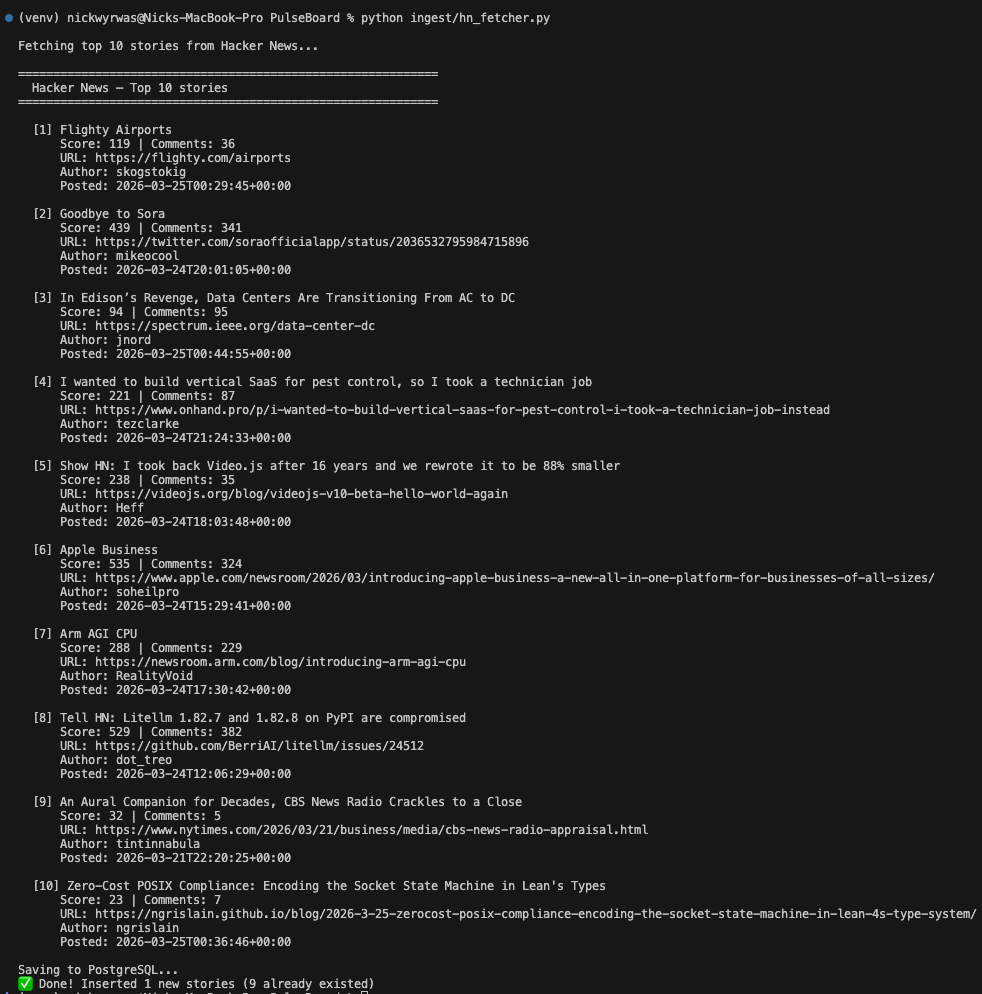

#### NewsAPI Fetcher

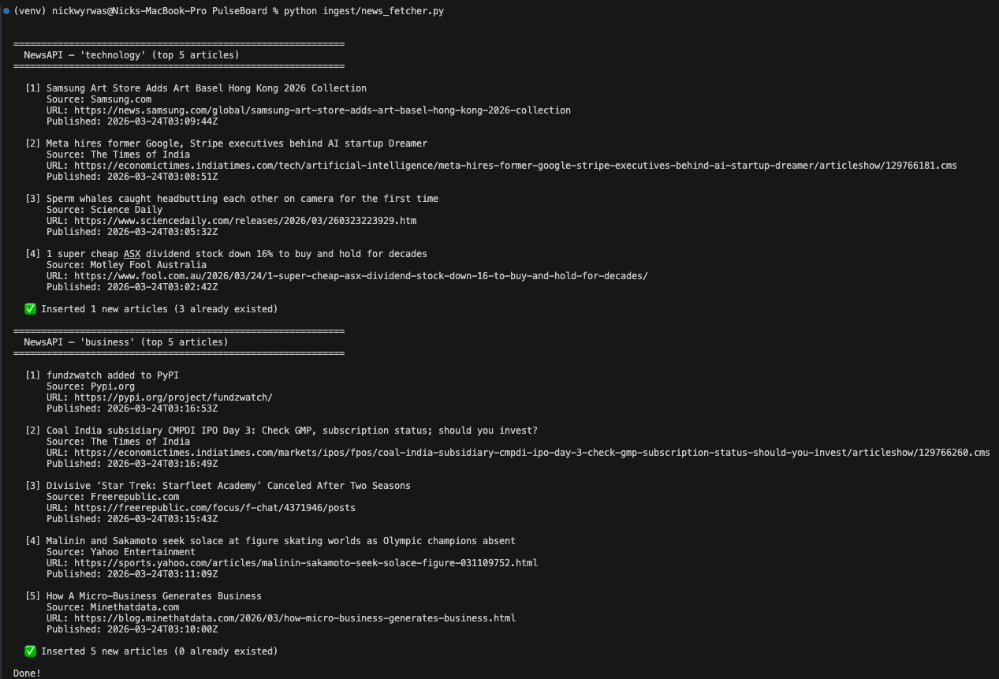

---

### Phase 3 — dbt Transformations ✅

**What was built:** A dbt project with a staging layer (cleaning raw data) and a marts layer (joining sources and ranking trending topics), plus schema tests for data quality.

**Key implementation details:**
- `stg_hn_stories` and `stg_news_articles` — staging models that pass through columns, cast `created_utc`/`published_at` to `DATE` for day-level grouping, and filter null titles
- `mart_trending_topics` — a marts model using CTEs, `UNION ALL`, and `RANK()` window functions to combine both sources and rank topics by mention count
- `ref()` used for all model dependencies so dbt automatically determines execution order
- Schema tests enforce `unique` and `not_null` on primary keys and titles across both staging models

> **Challenge:** dbt crashed on startup with a `mashumaro.exceptions.UnserializableField` error — a compatibility issue between dbt's dependencies and Python 3.14.
>
> **Solution:** Recreated the virtual environment with Python 3.13, which has stable support for dbt 1.11 and all its dependencies. Kept all existing project code compatible.

> **Challenge:** The `mart_trending_topics` model returned data for Hacker News but not for news articles, even though articles existed in the database.
>
> **Solution:** The articles' `published_at` timestamps had aged past the 24-hour filter window. Widened the time window to 7 days during development. In production (Phase 4), the hourly Airflow schedule keeps fresh data flowing within the window.

#### dbt Run — All 3 Models Passing

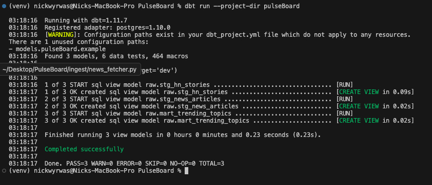

#### dbt Test — All 6 Data Quality Tests Passing

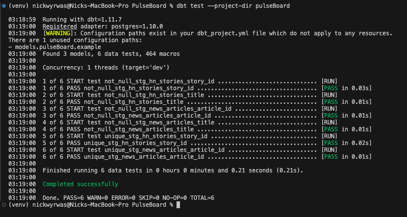

#### Trending Topics Query Results

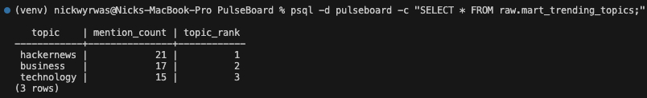

---

### Phase 4 — Airflow Orchestration ✅

**What was built:** An Apache Airflow DAG that orchestrates the entire pipeline — fetching data from both sources and running dbt transformations — on an hourly schedule with monitoring via the Airflow web UI.

**Key implementation details:**
- `pulseBoard_pipeline` DAG with three `BashOperator` tasks chained in sequence
- Task dependency chain: `fetch_hn_stories` >> `fetch_news_articles` >> `run_dbt_models`
- Scheduled with `@hourly` cron and `catchup=False` to prevent backfilling past runs
- Each task uses absolute paths to the virtual environment's Python and dbt binaries
- Configured `dags_folder` in `airflow.cfg` to point to the project's `dags/` directory
- Retry logic: 1 retry with a 5-minute delay on task failure

> **Challenge:** Airflow's default `dags_folder` points to `~/airflow/dags`, not our project directory, so the DAG wasn't detected.
>
> **Solution:** Updated `airflow.cfg` to point `dags_folder` to `/Users/nickwyrwas/Desktop/PulseBoard/dags`. The DAG appeared in the Airflow UI immediately after restarting the scheduler.

#### Airflow Home — Pipeline Health Dashboard

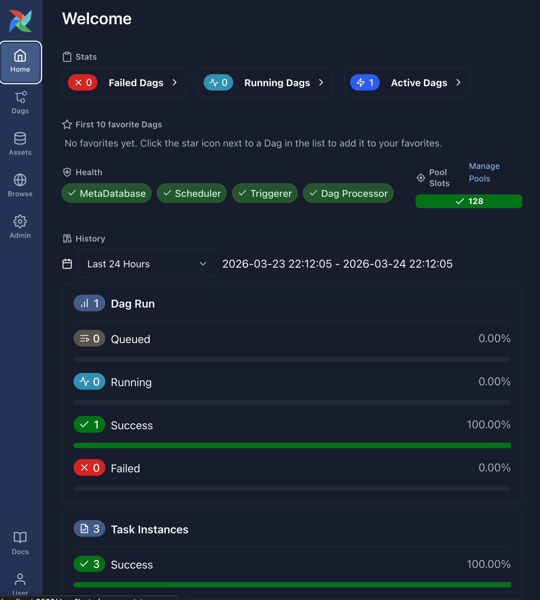

#### DAGs List — pulseBoard_pipeline Active and Scheduled

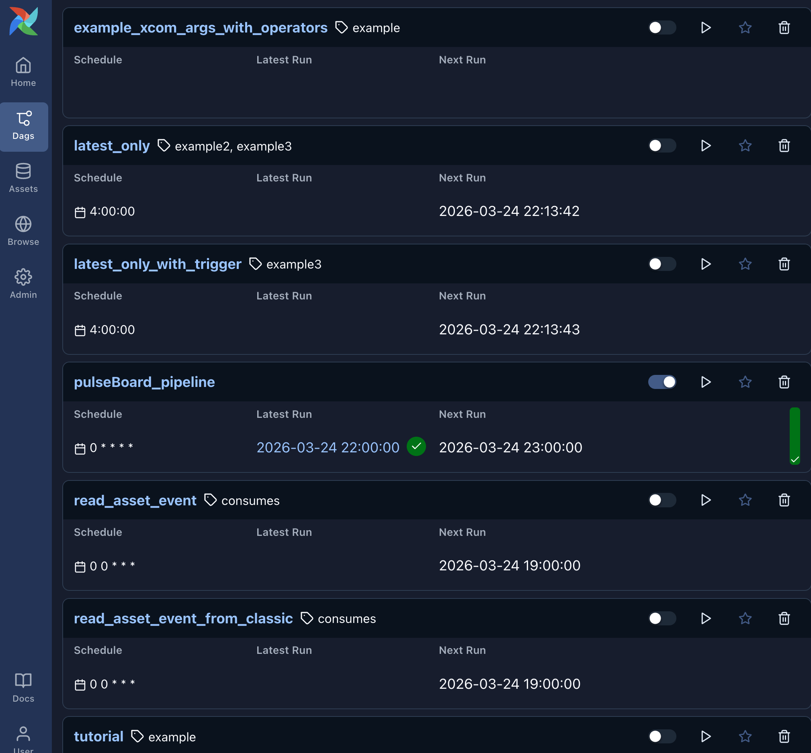

#### DAG Overview — Task Execution Details

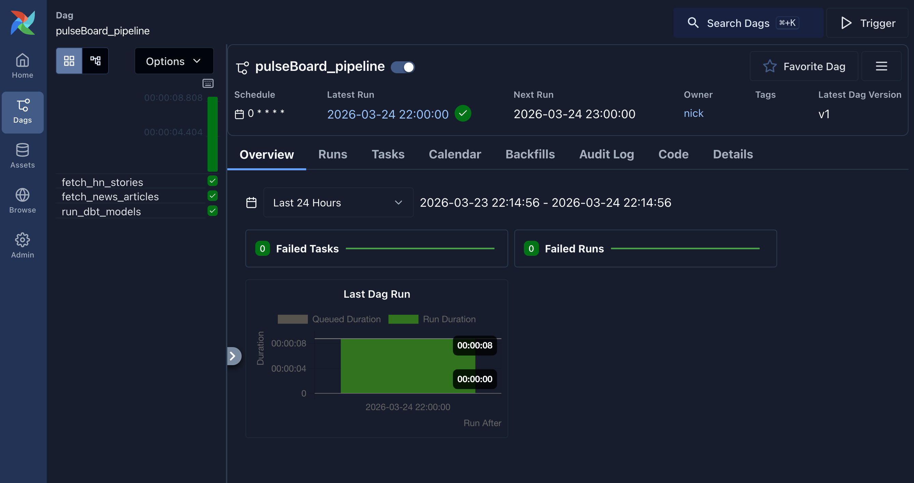

#### DAG Tasks — Three-Step Pipeline

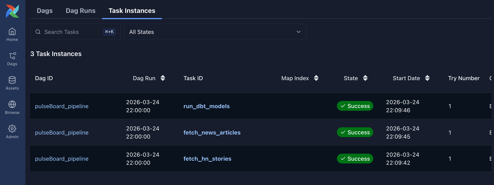

---

### Phase 5 — FastAPI REST API ✅

**What was built:** A FastAPI REST API that serves pipeline data from PostgreSQL through three endpoints, with CORS middleware for frontend access and auto-generated interactive documentation.

**Key implementation details:**
- Three endpoints: `GET /trending`, `GET /hn/stories`, and `GET /news/articles` serving data as JSON
- `RealDictCursor` from psycopg2 returns rows as dictionaries, which FastAPI auto-converts to JSON responses
- Parameterized SQL queries with `%s` placeholders to prevent SQL injection — never f-strings in SQL
- Optional query parameters: `?limit=20` for pagination, `?topic=technology` for filtering articles
- CORS middleware with `allow_origins=["*"]` enables the Next.js frontend to call the API across ports
- FastAPI auto-generates interactive Swagger documentation at `/docs`

> **Challenge:** Running `uvicorn main:app` from the project root failed with "Could not import module main."
>
> **Solution:** Used the module path syntax `uvicorn api.main:app` so Python could resolve the import from the project root directory.

#### FastAPI Interactive Docs (Swagger UI)

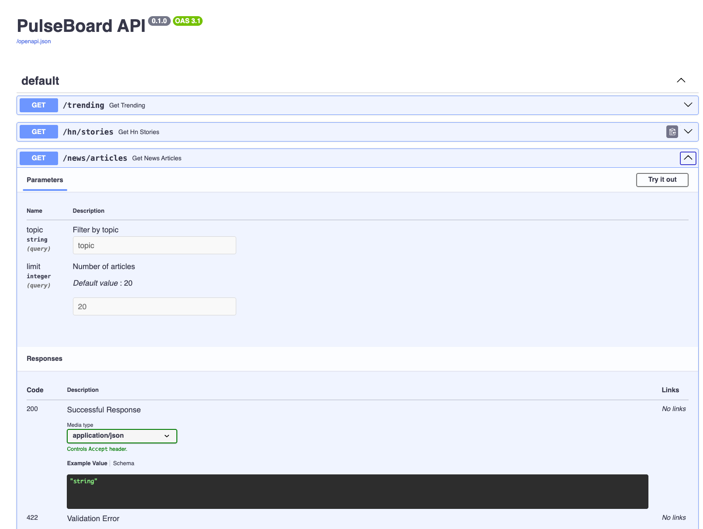

#### Trending Topics JSON Response

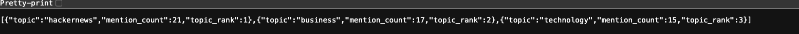

#### Hacker News Stories JSON Response

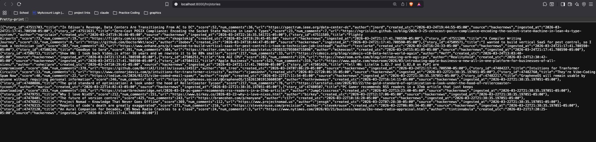

---

### Phase 6 — Next.js Dashboard ✅

**What was built:** A live Next.js 14 dashboard with Tailwind CSS that visualizes trending topics, Hacker News stories, and news headlines — auto-refreshing every 60 seconds via SWR.

**Key implementation details:**
- Four components: `Navbar`, `TrendingTopics`, `PostFeed`, and `NewsFeed`
- SWR (`useSWR` hook) handles data fetching with `refreshInterval: 60000` for automatic 60-second polling
- TrendingTopics displays visual volume bars scaled proportionally to the highest mention count
- Responsive grid layout: PostFeed and NewsFeed display side-by-side on desktop, stacked on mobile
- Dark mode UI with `bg-gray-950` base, `bg-gray-800` cards, and `blue-400` accent links
- All story and article titles are clickable links that open in a new tab
- Loading and error states handled gracefully for each component

> **Challenge:** The project scaffolded with TypeScript (`.tsx` files) but the component examples used `.js` extensions.
>
> **Solution:** Created all components as `.tsx` files to match the project's TypeScript configuration. The JSX code worked identically in both formats.

#### PulseBoard Live Dashboard

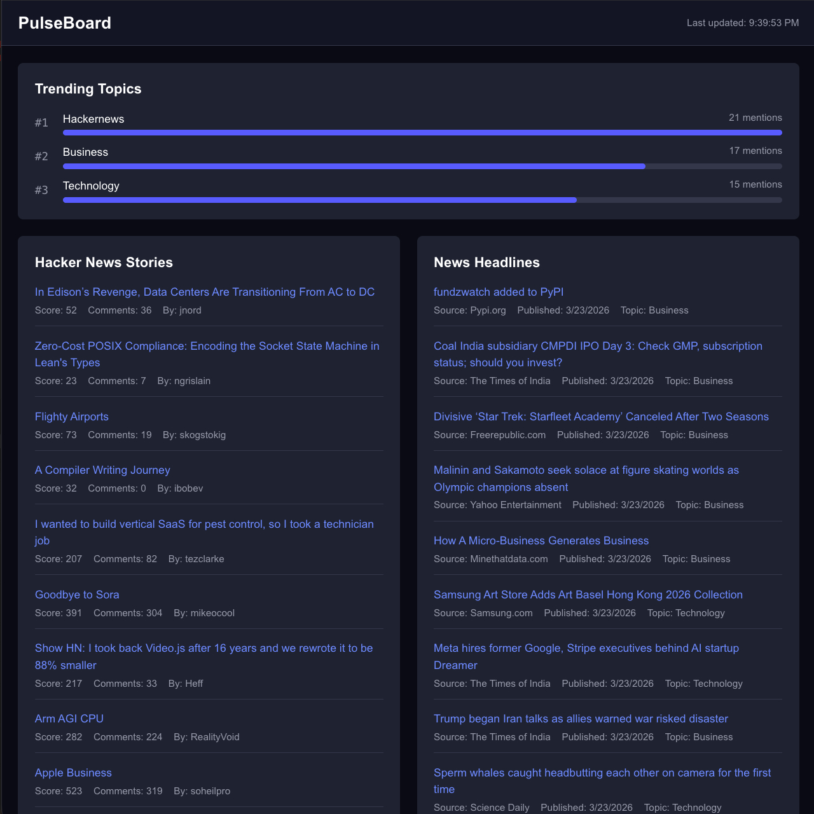

---

### Phase 7 — Kafka Streaming ✅

**What was built:** A real-time streaming layer using Apache Kafka as an alternative to Airflow's scheduled batch processing — a Kafka producer streams Hacker News stories to a topic, and a Kafka consumer reads from that topic and writes to PostgreSQL in real time.

**Key implementation details:**
- Local Kafka broker and Zookeeper orchestrated via Docker Compose (`docker-compose.yml`)
- `confluent-kafka` Python library (C-backed, production-grade) for both producer and consumer
- Producer fetches top HN stories and publishes each as a JSON message to the `pulseboard.hn_stories` topic
- Delivery confirmation via callback function — every message is verified as delivered before the script exits
- `producer.flush()` ensures all queued messages are confirmed delivered before the script exits
- Consumer uses `group.id` for offset tracking — Kafka remembers what's been read, so no duplicate processing
- `auto.offset.reset: earliest` ensures the consumer starts from the beginning of the topic on first run
- Consumer runs in an infinite loop with `consumer.poll(1.0)`, processing messages within 1 second of arrival
- Same `INSERT ... ON CONFLICT DO NOTHING` upsert logic as the batch fetchers — both paths write to the same table safely

**Batch vs Streaming — when to use each:**

| | Airflow (Batch) | Kafka (Streaming) |
|---|---|---|
| **Latency** | Up to 1 hour (scheduled) | Sub-second (real-time) |
| **Reliability** | Built-in retries, monitoring UI | Requires always-on infrastructure |
| **Complexity** | Simple — one DAG file | More moving parts (Zookeeper, broker, consumer) |
| **Best for** | Predictable, periodic data loads | Low-latency, event-driven pipelines |
| **Infrastructure** | Airflow scheduler only | Docker containers must be running |

> **Challenge:** `docker-compose` command was not found despite Docker being installed — newer Docker versions ship Compose as a plugin (`docker compose`) rather than a standalone binary.
>
> **Solution:** Installed `docker-compose` via Homebrew (`brew install docker-compose`) to get the standalone binary. Also discovered Docker Desktop must be actively running (not just installed) for the Docker daemon to accept connections.

> **Challenge:** The Kafka consumer ran but produced no output on the first attempt — the file appeared to be empty when executed.
>
> **Solution:** The file hadn't saved properly in the editor. After re-saving with the full consumer code, running the consumer in one terminal while producing in another confirmed real-time message flow — 10 stories produced, 10 consumed and saved to PostgreSQL.

> **Challenge:** The `docker-compose.yml` file had an indentation error — YAML requires consistent spacing for nested properties, and misaligned keys caused a `services.container_name must be a mapping` error.
>
> **Solution:** Fixed the indentation so all properties under the `zookeeper` service were properly nested at the same level. YAML is whitespace-sensitive — a lesson in why infrastructure-as-code requires the same attention to detail as application code.

#### Kafka Producer — Streaming Stories to Topic

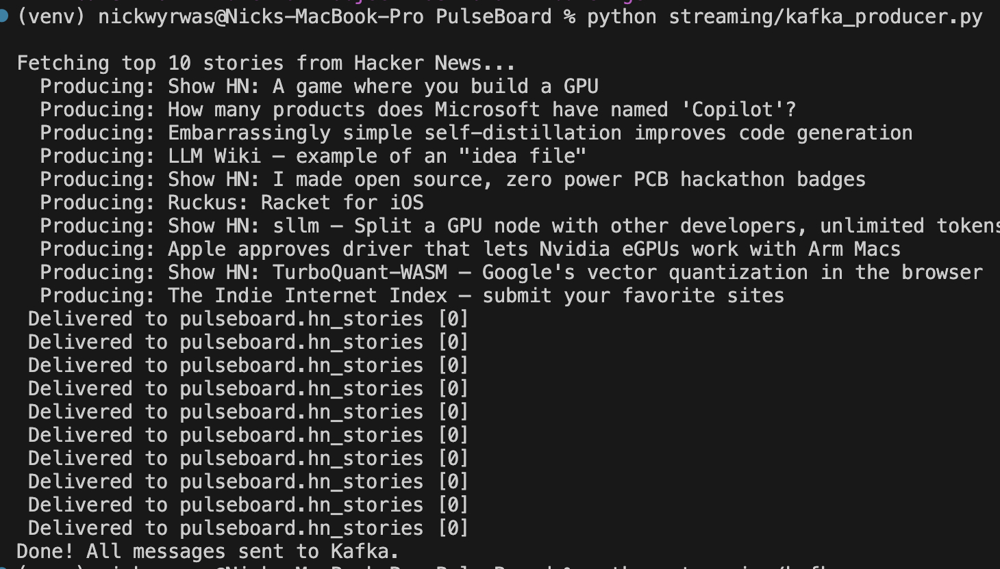

#### Kafka Consumer — Real-Time Ingestion to PostgreSQL

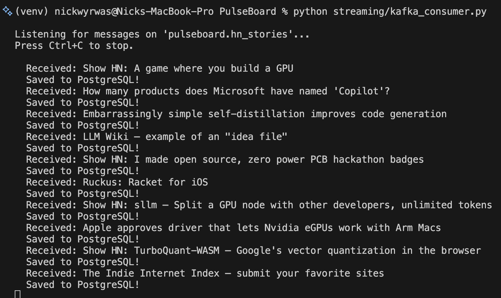

---

### Phase 8 — Sentiment Analysis 🔲

**Planned:** Add NLP-powered sentiment scoring to every story and article in the pipeline.

- Use TextBlob or VADER (free Python NLP libraries) to classify headlines as positive, negative, or neutral
- Add `sentiment_score` and `sentiment_label` columns to the database
- Create a new dbt model to aggregate sentiment trends by topic over time
- Add a Sentiment Trends section to the dashboard with visual indicators

---

### Phase 9 — Docker Compose 🔲

**Planned:** Containerize the entire stack so anyone can run PulseBoard with a single command.

- Dockerfiles for the FastAPI API and Next.js dashboard
- Docker Compose configuration orchestrating PostgreSQL, API, dashboard, and Airflow
- Environment variable management via `.env` with Docker secrets
- Single `docker compose up` to launch the full pipeline

---

### Phase 10 — CI/CD Pipeline 🔲

**Planned:** Automate testing and quality checks on every pull request with GitHub Actions.

- GitHub Actions workflow triggered on PR to `main`
- Run dbt tests to validate data model integrity
- Run linting (Python + JavaScript/TypeScript)
- Prevent merging PRs that break the pipeline

---

### Phase 11 — Authentication 🔲

**Planned:** Add user login to the dashboard with saved preferences and personalized views.

- NextAuth.js integration with GitHub or Google OAuth
- User-specific dashboard preferences (favorite topics, refresh interval)
- Protected API routes requiring authentication
- Session management with secure token handling

---

### Phase 12 — Email & Slack Alerts 🔲

**Planned:** Notify users when a topic spikes in mentions — a real-world pipeline alerting feature.

- Monitor `mart_trending_topics` for sudden spikes in mention count
- Send email alerts via Python `smtplib` (free, no API key needed)
- Optional Slack notifications via incoming webhooks
- Configurable alert thresholds and cooldown periods to prevent alert fatigue

---

## Project Structure

```
PulseBoard/
├── .env                  # API keys and secrets (not committed)
├── .env.example          # Template showing required env vars
├── .gitignore
├── README.md
├── docker-compose.yml    # Kafka + Zookeeper local infrastructure
├── ingest/
│   ├── hn_fetcher.py     # Hacker News batch ingestion script
│   └── news_fetcher.py   # NewsAPI batch ingestion script
├── streaming/
│   ├── kafka_producer.py # Kafka producer — streams HN stories to topic
│   └── kafka_consumer.py # Kafka consumer — reads topic, writes to PostgreSQL
├── pulseBoard/           # dbt project
│   ├── dbt_project.yml
│   └── models/
│       ├── staging/
│       │   ├── schema.yml
│       │   ├── stg_hn_stories.sql
│       │   └── stg_news_articles.sql
│       └── marts/
│           └── mart_trending_topics.sql
├── dags/
│   └── pulseBoard_pipeline.py  # Airflow DAG
├── api/
│   └── main.py               # FastAPI REST API
├── dashboard/                 # Next.js 14 frontend
│   └── app/
│       ├── page.tsx           # Main dashboard page
│       └── components/
│           ├── Navbar.tsx
│           ├── TrendingTopics.tsx
│           ├── PostFeed.tsx
│           └── NewsFeed.tsx
└── public/images/             # Screenshots for documentation
```

---

## Getting Started

### Prerequisites
- Python 3.13+
- PostgreSQL 14+
- Node.js 18+
- Docker Desktop (for Kafka streaming)
- A free API key from [NewsAPI](https://newsapi.org/register)

### Setup

1. **Clone the repo**
   ```bash
   git clone https://github.com/nwyrwas/PulseBoard.git
   cd PulseBoard
   ```

2. **Create a virtual environment and install dependencies**
   ```bash
   python3.13 -m venv venv
   source venv/bin/activate
   pip install requests psycopg2-binary python-dotenv dbt-postgres fastapi uvicorn confluent-kafka
   ```

3. **Create the database and tables**
   ```bash
   createdb pulseboard
   psql -d pulseboard -c "
   CREATE SCHEMA IF NOT EXISTS raw;

   CREATE TABLE IF NOT EXISTS raw.hn_stories (
       story_id     INTEGER PRIMARY KEY,
       title        TEXT NOT NULL,
       score        INTEGER DEFAULT 0,
       num_comments INTEGER DEFAULT 0,
       url          TEXT,
       author       TEXT,
       created_utc  TIMESTAMPTZ NOT NULL,
       source       TEXT DEFAULT 'hackernews',
       ingested_at  TIMESTAMPTZ DEFAULT NOW()
   );

   CREATE TABLE IF NOT EXISTS raw.news_articles (
       article_id   TEXT PRIMARY KEY,
       title        TEXT NOT NULL,
       description  TEXT,
       url          TEXT NOT NULL,
       source_name  TEXT,
       published_at TIMESTAMPTZ,
       topic        TEXT,
       ingested_at  TIMESTAMPTZ DEFAULT NOW()
   );
   "
   ```

4. **Set up environment variables**
   ```bash
   cp .env.example .env
   # Edit .env and add your NewsAPI key
   ```

5. **Run the pipeline**
   ```bash
   python ingest/hn_fetcher.py
   python ingest/news_fetcher.py
   dbt run --project-dir pulseBoard
   dbt test --project-dir pulseBoard
   ```

6. **Verify results**
   ```bash
   psql -d pulseboard -c "SELECT * FROM raw.mart_trending_topics;"
   ```

7. **Start the API**
   ```bash
   uvicorn api.main:app --reload --port 8000
   ```

8. **Start the dashboard** (in a separate terminal)
   ```bash
   cd dashboard
   npm install
   npm run dev
   ```

9. **Open the dashboard**
   - Dashboard: [http://localhost:3000](http://localhost:3000)
   - API Docs: [http://localhost:8000/docs](http://localhost:8000/docs)

10. **(Optional) Run Kafka streaming** — requires Docker Desktop running
    ```bash
    docker-compose up -d
    # Terminal 1: Start the consumer
    python streaming/kafka_consumer.py
    # Terminal 2: Run the producer
    python streaming/kafka_producer.py
    ```

---

## Author

**Nick Wyrwas**
- GitHub: [@nwyrwas](https://github.com/nwyrwas)
- Email: nick.wyrwas@outlook.com
- LinkedIn: linkedin.com/in/nicholas-wyrwas
---

## Project Links

[View on GitHub](https://github.com/nwyrwas/PulseBoard)
